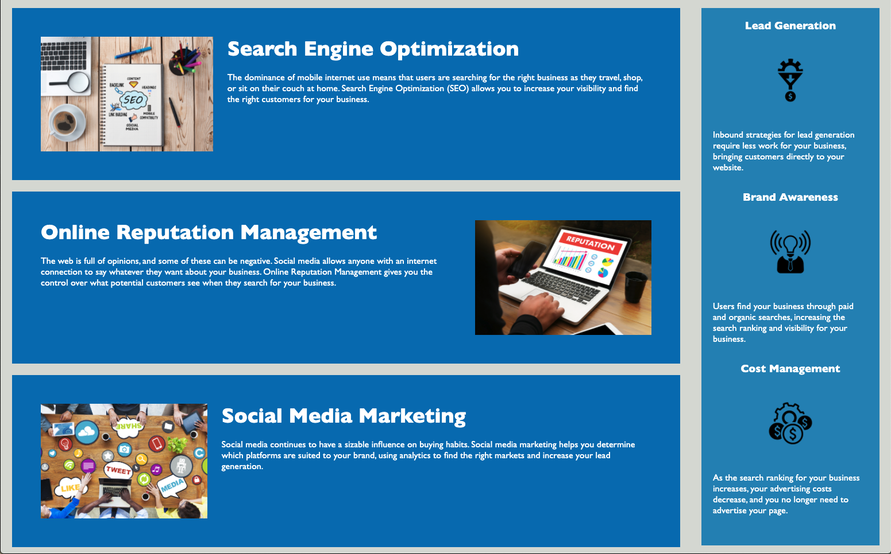

# Horiseon Services
## Code accessibility and search engine optimization

- Added semantic elements to allow accessibility for screen readers.

- Flow of CSS matches flow of HTML.

- Consolidated redunduncies in CCS.

- Visit here: https://johannt91.github.io/horiseon-web-services/

